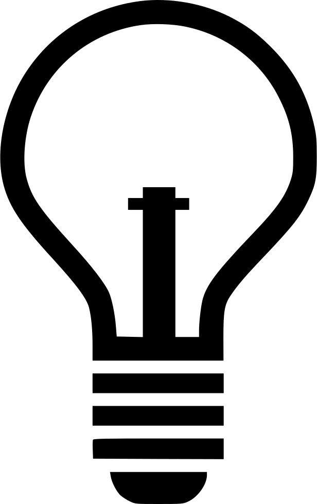

<!-- Hack 1: add a character display to text when 8 bits, determine if printable or not printable -->
<!-- Hack 2: change to 24 bits and add a color code and display color when 24 bits, think about display on this one -->
<!-- Hack 3: do your own thing -->

    <header class="pb-3 mb-4 border-bottom border-primary text-dark">
        Binary Math with Conversions
    </header>
    <table class="coolertable">
        <tr><th colspan="2">Enter bits below:</th></tr>
        <tr>
            <td><input type="text" id="inputBox" style="width:100%"></td>
            <td width="25%"><button onclick="setBits()" style="width:100%">Submit</button></td>
        </tr>
        <tr><td colspan="2"><i id="message"></i></td></tr>
    </table>
    

                <table class="table">
                <tr id="table">
                    <th>Plus/Minus</th>
                    <th>Binary</th>
                    <th>Octal</th>
                    <th>Hexadecimal</th>
                    <th>Decimal</th>
                </tr>
                <tr>
                    <td id="inputAdd2"><input type="text" id="inputAdd"></td>
                    <td id="binary">00000000</td>
                    <td id="octal">0</td>
                    <td id="hexadecimal">0</td>
                    <td id="decimal">0</td>
                </tr>
                <tr><td colspan="5"><i id="message2"></i></td></tr>
                </table>
            

